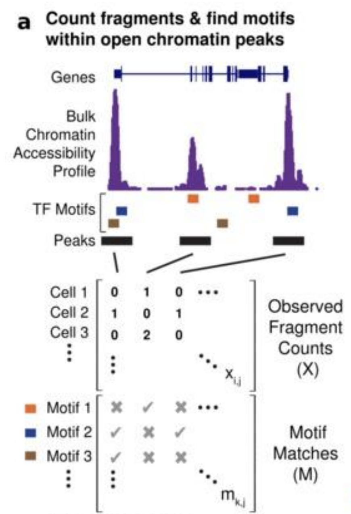

# ChromVar

This is a walkthrough of how to use chromVar with your scATAC-seq data. This tutorial is based on the walkthrough available through the [Greenleaf lab](https://greenleaflab.github.io/chromVAR/articles/Introduction.html). 

## Overview

### Inputs

ChromVAR takes as input two matrices:

#### 1) Peaks x cells matrix

The peaks by cells matrix counts the number of fragments per peak for each of the cells in the experiment.


#### 2) Motif x peaks matrix

The motifs by peak matrix is a binary matrix that has *each peak is a row* in the matrix and *each motif is a column*.



### Outputs

#### motif x cells deviations scores matrix

```R
##                singles-GM12878-140905-1 singles-GM12878-140905-2
## MA0025.1_NFIL3               -0.5767749                 0.820191
## MA0030.1_FOXF2               -0.7841626                -1.099900
## MA0031.1_FOXD1               -0.6978056                -2.146026
```

##### How are motifs derived?

The motifs are derived from cisBP, JASPAR, or some other motif database. The motifs are then filtered to remove redundant motifs. The term motif can refer to a motif, kmer, or any type of genomic annotation. The actual genomic regions that are bound by the motif do not matter, but only the fact that a motif was present in a peak matters.

