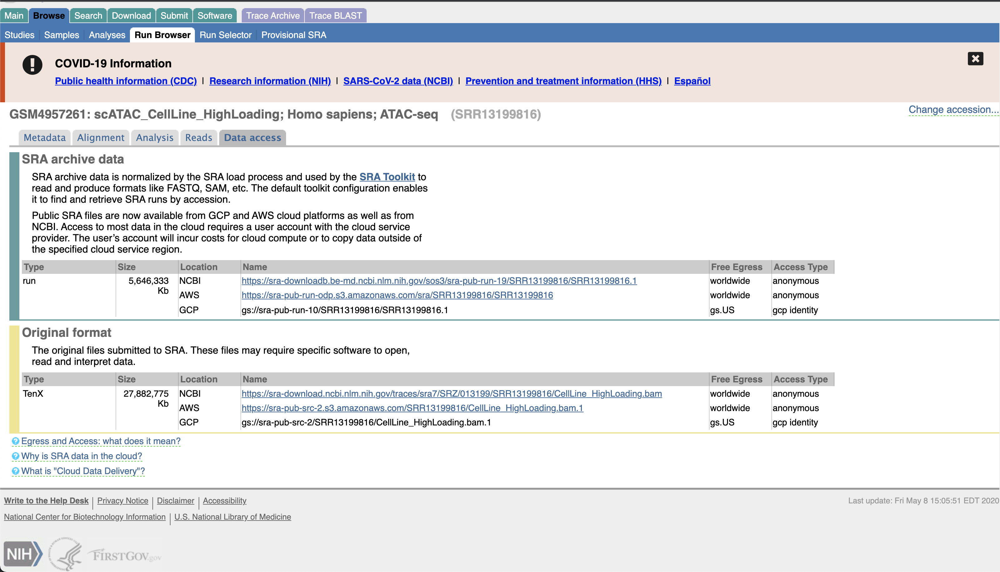

# Downloading 10X Genomics Data

Data is available as an SRA file usually after publication. Some groups choose to only upload the BAM file that has been aligned to a specific genome already. This section covers how to approach both situations and map the results to the reference of your choice.


Data that is published is usually available through the [SRA](https://www.ncbi.nlm.nih.gov/sra) database. We will download the data from the ArchR paper using the [GEO](https://www.ncbi.nlm.nih.gov/geo/query/acc.cgi?acc=GSM4957261) website. Reference the [10X SRA download page](https://kb.10xgenomics.com/hc/en-us/articles/115003802691-How-do-I-prepare-Sequence-Read-Archive-SRA-data-from-NCBI-for-Cell-Ranger-) to learn more about downloading 10X data.

## Downloading SRA files

Data is usually available through the SRA database. In order to download data from SRA you can interact with the website and download each file individually, or you can programatically download the data using the [SRAtoolkit](https://github.com/ncbi/sra-tools). You can download the data locally using the `prefetch` command.

### Example code: fastq-dump

```bash
# Prefetch data
prefetch SRX9633387
prefetch SRX9633388

# Convert SRA to fastq
fastq-dump --origfmt --gzip --split-files SRX9633387 
fastq-dump --origfmt --gzip --split-files SRX9633388
```

This process takes about 4 hours. I had issues with downloading the data for this experiment from SRA, so I instead use the [bam2fastq](https://github.com/10XGenomics/bamtofastq) package available from 10X genomics.

## Downloading a BAM from GEO and convering it to FASTQs

The ArchR publication stored their data as BAM files available through the [GEO](https://www.ncbi.nlm.nih.gov/geo/query/acc.cgi?acc=GSM4957261) and [SRA](https://www.ncbi.nlm.nih.gov/sra) websites.



### Example code: bamtofastq

Download the bam file from the sra file. Make sure to download the TenX category of BAM files.

```bash
# Download the bam file from the sra file
wget https://sra-download.ncbi.nlm.nih.gov/traces/sra7/SRZ/013199/SRR13199816/CellLine_HighLoading.bam
wget https://sra-download.ncbi.nlm.nih.gov/traces/sra6/SRZ/013199/SRR13199817/CellLine_LowLoading.bam

# bamtofastq {options} {bam} {output_dir}
bamtofastq-1.3.2 --nthreads=12 CellLine_HighLoading.bam /scratch/caz3so/Granja2021_scATAC/input/fastq/CellLine_HighLoading
bamtofastq-1.3.2 --nthreads=12 CellLine_LowLoading.bam /scratch/caz3so/Granja2021_scATAC/input/fastq/CellLine_LowLoading
```

This process took ~45 minutes using 16 cores and 32GB memory.

## Comparing methods

I had issues with using both fastq-dump and fasterq-dump with SRA files. I found that the bamtofastq program provided by 10X is fast and easy to use. There are differences in the total number of reads produced, but these are a few hundred reads that are < 1 bp in length.

| Name         | Fastq-dump  | bam2fastq   | Difference |
|--------------|-------------|-------------|------------|
| High Loading | 307,258,971 | 307,263,619 | 4,648      |
| Low Loading  | 104,574,240 | 104,575,056 | 816        |